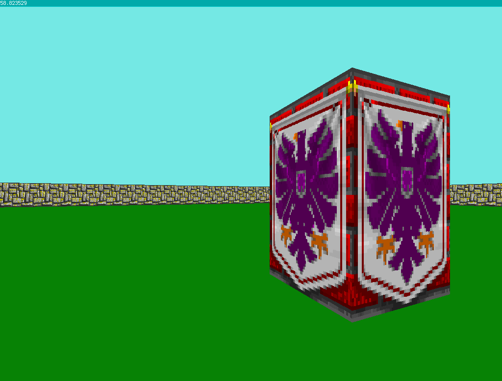

# raycaster
## Overview
This is a basic raycasting (i.e. Wolfenstein 3D) engine implemented in C++ using SDL2.

## Features (So Far)
+ Texture-mapping (walls only)
+ 60(ish) FPS update interval
+ WASD/arrow keys for movement

## Planned Additions
+ Rebindable controls
+ Adjustable resolution, FOV, and framerate
+ Enemies and other entities
+ Level editor

## Screenshots

